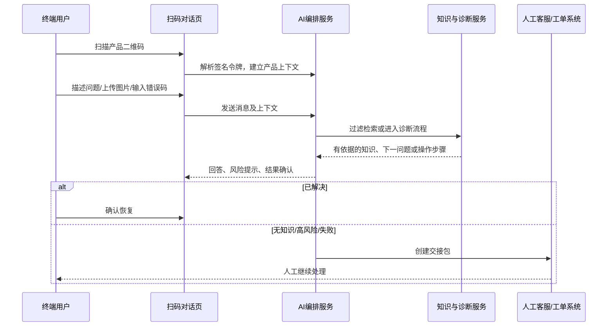
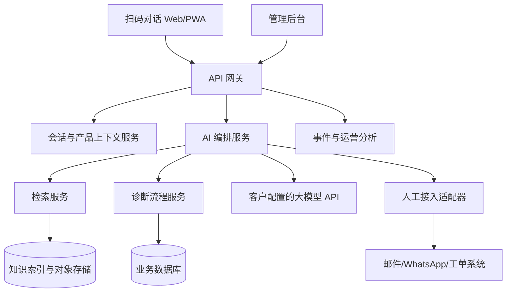

# 海外硬件 AI 智能客服平台

## 从 0 到首个 MVP 的功能拆解、实施方案与难点分析

**版本**：讨论初稿 v1.0  
**目标**：为合伙人、产品、研发和首个试点客户提供同一份可执行蓝图。  
**产品定位**：面向出海硬件厂商的“设备售后解决代理”平台，而非通用聊天机器人。

---

## 0. 结论先行

首个 MVP 的目标不是证明“大模型能聊天”，而是证明以下闭环成立：

> 用户扫码后，平台能够准确确定设备范围；针对高频问题以安全、可验证的步骤引导用户；无法解决时把完整上下文交给人工；人工解决经验能被审核后沉淀为新知识。

### 已知事实、设计假设与待验证事项

| 类型 | 内容 | 对 MVP 的影响 |
| --- | --- | --- |
| 用户已明确的事实 | 目标客户是出海硬件厂商；希望私有化部署；用户通过二维码进入；支持图文对话、人工接入、知识训练、模型配置和统计。 | MVP 必须具备多租户边界、产品上下文、知识治理和人工协同。 |
| 设计假设 | 第一批客户的说明书、历史工单和产品专家可获得；高频问题存在可标准化的处理路径。 | 需要在立项前的数据审计中验证，否则项目会卡在“无可用知识”。 |
| 待验证 | 首个品类、试点客户、真实工单质量、目标语言、现有工单渠道、私有化的真实约束和预算。 | 这些决定 MVP 的范围，不能由产品团队凭空假定。 |

### MVP 成功定义

MVP 完成不是“页面开发完成”，而应同时满足：

1. 一家试点厂商可以自行管理一个产品系列的产品、文档和基础知识。
2. 用户通过二维码进入后，不会跨型号、跨地区使用错误知识。
3. 高频咨询与故障能走完整的“提问 - 操作 - 结果确认”流程。
4. 无证据、冲突、高风险或连续失败时，系统稳定升级人工。
5. 管理员可以看到未解决问题、转人工原因、知识缺口和版本影响。
6. 每次知识或模型策略变更，都能在一组真实工单测试集上回归验证。

---

## 1. MVP 的边界与优先级

### 1.1 首个 MVP 推荐范围

- 1 家试点厂商。
- 1 个硬件品类，1 个产品系列，允许少量同系列型号。
- 扫码进入的 Web/PWA 对话页。
- 英语 + 1 门目标市场语言；其他语言先由浏览器翻译或人工处理。
- 文字、图片上传、错误码输入。
- 文档知识库 + 审核后的 FAQ + 高频故障诊断流程。
- 邮件、WhatsApp 或客户现有工单系统中的一种人工接入。
- 客户独立实例 + 客户配置外部大模型 API。
- 基础运营统计与质量抽检。

### 1.2 明确不纳入 MVP

- 全硬件品类支持。
- 语音客服、电话机器人和全渠道呼叫中心。
- 自动退款、自动换货、自动远程控制设备。
- 复杂维修工单、备件库存、维修网点调度。
- 完全离线本地大模型。
- 未经人工审核的自动知识发布。

### 1.3 功能优先级表

| 领域 | P0：首个 MVP 必须有 | P1：试点稳定后 | P2：规模化后 |
| --- | --- | --- | --- |
| 用户入口 | 二维码解析、产品上下文、语言选择、对话页 | 序列号校验、会话续接 | 多渠道统一身份 |
| AI 对话 | 文本、图片、错误码、流式回答、引用知识 | 主动问题推荐、语音输入 | 语音/电话 Agent |
| 诊断 | FAQ、受控诊断流程、步骤结果确认、风险停机 | 动态故障树、工具调用 | 遥测诊断、远程控制 |
| 知识 | 上传、解析、元数据、审核发布、版本回滚 | 历史工单挖掘、冲突检测 | 跨厂商知识模板市场 |
| 人工协同 | 转人工、交接包、状态回写 | 坐席工作台、SLA 队列 | 多渠道全量工单系统 |
| 管理后台 | 产品、二维码、知识、模型配置、基础统计 | 角色权限、审核流、多语言术语库 | 集团级组织与跨实例运营 |
| 平台能力 | 客户独立实例、审计日志、基础限流 | 客户 VPC、SSO、细粒度权限 | 离线部署、模型路由、区域容灾 |

---

## 2. 用户角色与关键场景

| 角色 | 目标 | 关键动作 | 成功结果 |
| --- | --- | --- | --- |
| 终端用户 | 尽快恢复设备使用或获得售后路径 | 扫码、描述问题、上传图片、执行步骤 | 问题解决或得到明确的人工处理承诺 |
| 人工客服 | 不重复问问题，快速处理复杂个案 | 查看交接包、补充处理、标注结果 | 更短处理时长，更少重复沟通 |
| 售后专家 | 将经验变成可复用方案 | 审核知识草稿、编写故障流程、定义安全边界 | 高价值经验被长期复用 |
| 厂商管理员 | 控制产品、知识、模型和渠道 | 配置产品/二维码/知识/人工接入 | 业务可控、可审计、成本可见 |
| 平台运营人员 | 保证系统可靠与可交付 | 租户开通、健康检查、版本升级 | 不跨租户、不丢会话、可定位问题 |

### 首个用户旅程



---

## 3. 功能拆解与详细说明

### 3.1 用户前台：扫码对话与售后入口

#### A. 二维码与设备上下文

**目的**：在第一条消息前缩小知识范围，避免错误型号答案。

**P0 功能**：

- 解析二维码中的 `tenantId`、`productModelId`、`region`、可选 `batch/serial` 和签名令牌。
- 校验令牌完整性和有效期；无效令牌进入“手动选择产品”降级页。
- 展示已识别产品名称、产品图片和地区；允许用户纠正，但必须保留原始扫码上下文。
- 创建匿名会话 ID，不要求用户先注册。
- 自动读取浏览器语言，用户可切换语言。

**验收标准**：二维码失效、产品下架、地区不匹配、用户改选型号等场景均有明确提示；服务端必须重新校验产品归属，前端参数不可直接决定知识范围。

#### B. 对话与信息采集

**P0 功能**：

- 文本消息、图片上传、错误码快捷输入。
- 图片上传前提示隐私，不允许上传身份证、银行卡等不必要信息。
- 支持流式回答、重新生成、复制回答和“已解决/未解决”反馈。
- 对话中展示当前产品、已识别的固件/错误码/问题分类。
- AI 一次最多要求用户完成一个关键步骤，随后询问结果。

**验收标准**：网络中断可提示重试；图片上传失败不丢失文字；回答过程中用户仍可终止和转人工。

#### C. 转人工页面

**P0 功能**：

- 用户可主动转人工。
- 系统可因安全、证据不足、流程失败、保修/退款等原因自动转人工。
- 用户填写最小联系方式与许可；显示预计的联系渠道和时区说明。
- 显示工单/请求编号，避免用户重复提交。

---

### 3.2 AI 编排与诊断引擎

#### A. 意图识别与路由

将每条输入先分流为：产品咨询、安装配置、故障排查、错误码、账号/订单、保修/退换、投诉、安全风险、人工请求、无关内容。

**P0 决策**：意图识别的输出是受控枚举，而不是自由文本。路由规则优先于生成模型：安全、政策、人工请求等意图直接进入确定流程。

#### B. 知识回答路径

1. 用租户、产品型号、硬件版本、固件版本、地区、语言、有效期做硬过滤。
2. 使用关键词和向量的混合检索；型号、错误码、接口名等精确术语必须保留关键词权重。
3. 对候选结果重排序；只把少量最相关内容传给生成模型。
4. 模型仅根据引用内容回答，给出来源标题和知识版本。
5. 证据不足时不回答事实性结论，改为追问、推荐诊断或转人工。

#### C. 诊断流程路径

诊断流程是受控状态机，不是模型自由发挥。每个节点包含：

```yaml
nodeId: wifi-check-01
type: question | instruction | decision | handoff | end
prompt: 请确认设备能否搜索到其他 Wi-Fi 网络？
expectedInput: yes_no_unknown
preconditions: 产品型号=X100; 固件>=2.1
onYes: wifi-check-02
onNo: network-reset-01
onUnknown: image-request-01
safetyStop: false
sourceRefs: [KB-102, MANUAL-X100-3.2]
```

**P0 规则**：模型可以把节点内容翻译成自然语言、解释原因、理解用户回答，但不能修改流程跳转、跳过安全节点或自行创造维修操作。

#### D. 回答安全策略

- 未检索到有效证据：说明缺少信息或转人工。
- 多份知识冲突：优先最新已发布版本；仍冲突则转人工。
- 涉及电源、拆机、进水、发热、烧焦气味：停止用户操作并转人工。
- 涉及退款、换货、保修资格：只解释公开政策，不做自动承诺。
- 用户连续两次反馈步骤失败：进入人工升级判断，禁止无限循环。

---

### 3.3 知识运营后台

#### A. 产品中心

产品树建议为：`Tenant -> Brand -> Product Family -> Model -> Hardware Revision -> Firmware -> Region Variant`。

管理员可维护：型号别名、图片、配件、销售地区、固件适用区间、停售状态、二维码批次和保修策略关联。

#### B. 文档中心

**输入**：PDF、DOCX、HTML、FAQ、CSV 错误码表、图片、历史工单导入。

**处理流程**：上传 -> 病毒/格式校验 -> 文本/表格/OCR 解析 -> 元数据补齐 -> 去重 -> 分块/索引 -> 抽样校验 -> 草稿 -> 审核 -> 发布。

每个知识项必须具备：来源、责任人、适用型号、地区、语言、有效期、版本、审批状态、被引用次数和最后验证时间。

#### C. FAQ 与诊断流程编辑器

FAQ 适合单点事实；诊断流程适合多步问题。后台要让非研发的售后专家可以：

- 配置触发条件和适用范围。
- 编写问题、步骤、预期现象、分支和结束条件。
- 标记风险节点和强制人工节点。
- 关联来源文档，避免“专家口述但不可追溯”。
- 用模拟会话测试流程后再发布。

#### D. 审核和版本管理

建议状态：`draft -> review -> approved -> published -> deprecated -> archived`。

发布必须生成不可变版本；已发布会话要记录所使用的知识版本。发现错误时可以回滚或立即下架，而不是覆盖原文。

---

### 3.4 人工协同与工单集成

首个 MVP 只接一种渠道。无论是邮件、WhatsApp 还是现有工单系统，平台都需要内部统一的 `HandoffRequest` 对象。

**交接包字段**：

- 租户、产品型号、硬件/固件、地区、语言。
- 问题摘要、原始对话、用户联系方式和同意记录。
- 错误码、图片链接、已尝试步骤及结果。
- AI 采用/拒绝的知识、诊断流程节点、转人工原因。
- 优先级、状态、人工结果、人工最终解决方案。

人工关闭工单时，应至少选择：已解决/待配件/保修处理/用户放弃/重复问题/产品缺陷；并允许提议新增或修订知识。

---

### 3.5 分析、质量与运营

#### P0 看板

- 会话数、扫码数、产品/地区/语言分布。
- 意图分布、问题分类、错误码分布。
- 自主解决、用户主动转人工、系统自动转人工、放弃会话。
- 未解决问题 Top N、无答案问题 Top N、被差评回答 Top N。
- 知识使用量、过期知识、冲突知识、无来源回答拦截次数。
- 平均响应时长、平均对话轮次、图片上传成功率。

#### 质量抽检机制

管理员可以查看一段脱敏会话、引用知识、模型输出、最终结果和人工反馈。抽检标签至少包括：正确、部分正确、检索错误、知识缺失、流程问题、语言问题、安全风险、无需 AI 处理。

---

### 3.6 平台与非功能能力

| 能力 | MVP 要求 |
| --- | --- |
| 租户隔离 | 每个客户独立部署实例；数据、对象存储、向量索引和密钥逻辑隔离。 |
| 权限 | 至少区分平台运维、客户管理员、知识审核人、人工客服、只读分析员。 |
| 安全 | HTTPS、密钥加密保存、对象存储访问签名、审计日志、上传文件校验。 |
| 隐私 | 最小化采集、会话/附件保留期可配置、删除请求可执行、模型 API 数据流透明。 |
| 可观测性 | 请求 ID、会话 ID、模型耗时/费用、检索命中、错误率、工单创建结果。 |
| 限流与降级 | 模型不可用时提供人工入口与已发布 FAQ；不能输出无依据的兜底答案。 |

---

## 4. 核心数据模型与接口边界

### 4.1 主要实体

| 实体 | 关键字段 | 说明 |
| --- | --- | --- |
| Tenant | id, name, deployment, status | 一个厂商/客户组织。 |
| ProductModel | id, tenantId, family, model, region, status | 产品型号的主记录。 |
| ProductVariant | modelId, hwRevision, firmwareRange, region | 版本差异和适用范围。 |
| QRBinding | tokenId, productModelId, region, batch, status | 二维码与产品上下文映射。 |
| KnowledgeDocument | source, title, locale, owner, lifecycle | 原始文档与生命周期。 |
| KnowledgeRevision | documentId, version, applicability, approval | 一次可追溯发布版本。 |
| KnowledgeChunk | revisionId, text, metadata, vectorRef | 检索用内容片段。 |
| TroubleshootFlow | trigger, applicability, version, status | 一个故障流程。 |
| TroubleshootNode | flowId, nodeType, prompt, branches, safetyRule | 流程状态机节点。 |
| Conversation | tenantId, productContext, locale, status | 用户会话。 |
| Message | conversationId, role, content, citations, trace | 单条消息及生成轨迹。 |
| HandoffRequest | reason, payload, channel, state, outcome | 人工交接统一对象。 |
| EvaluationCase | input, expected, slice, label | 回归评测样本。 |
| FeedbackLabel | conversationId, category, reviewer, action | 质量抽检与知识闭环。 |

### 4.2 MVP 服务边界



### 4.3 建议的 API 列表

| 接口 | 用途 | MVP 关键约束 |
| --- | --- | --- |
| `POST /public/qr/resolve` | 解析二维码并创建会话上下文 | 服务端验签，返回最小公开产品信息。 |
| `POST /conversations/{id}/messages` | 发送消息/图片/结果确认 | 记录产品上下文、检索轨迹、知识版本。 |
| `POST /conversations/{id}/handoffs` | 用户或系统创建人工交接 | 生成统一交接包，渠道失败可重试。 |
| `POST /admin/documents` | 上传知识源 | 格式校验、异步解析、可追踪状态。 |
| `POST /admin/knowledge/{id}/publish` | 发布知识版本 | 必须有审核人与适用范围。 |
| `POST /admin/flows/{id}/simulate` | 模拟故障流程 | 不调用真实人工渠道，可验证分支覆盖。 |
| `POST /admin/evaluations/run` | 运行回归评测 | 输出按型号/语言/问题类型切片的结果。 |
| `GET /admin/analytics/overview` | 查看运营数据 | 支持按日期、型号、地区、语言筛选。 |

---

## 5. 首个 MVP 的实施阶段

> 下列周期是资源假设，不是交付承诺。假设团队具备 1 名产品/知识负责人、2 名后端、1 名前端、0.5 名测试/UX，并能稳定获得试点厂商专家支持。

### 阶段 0：发现与数据审计（约 1-2 周）

**输出物**：试点范围、数据清单、Top 问题分类、语言/地区矩阵、风险边界、验收基线。

**必须完成**：

- 访谈售后负责人、资深客服、海外销售/运营和 IT。
- 盘点说明书、FAQ、固件说明、错误码、历史工单、图片和政策文档。
- 抽样审查历史工单：是否有最终解决方案、型号/版本字段、语言、重复率、敏感信息。
- 确定人工接入渠道与转人工 SLA。
- 选择首批诊断主题，优先“高频、风险低、可标准化、已有证据”的问题。

**阶段闸门**：没有可用产品上下文或专家审核资源时，不进入开发；先补齐试点数据和职责。

### 阶段 1：领域基础与知识最小闭环（约 2 周）

**输出物**：产品模型、二维码方案、文档上传解析、知识审核发布、基础检索。

**验收**：管理员能将一份文档关联到型号/地区/版本，审核发布后，在测试查询中被正确过滤和引用。

### 阶段 2：用户对话与受控诊断（约 2-3 周）

**输出物**：扫码页面、文本/图片消息、意图路由、FAQ 回答、诊断流程引擎、安全规则。

**验收**：选定的高频场景可从扫码走到“解决/未解决/转人工”；系统不会因用户自由表达跳过关键安全节点。

### 阶段 3：人工协同与运营可见性（约 1-2 周）

**输出物**：一种人工渠道集成、交接包、人工结果回写、基础看板、抽检标注。

**验收**：随机抽取会话，人工无需再次询问型号和已尝试步骤；管理员能看到每个转人工的原因。

### 阶段 4：评测、灰度与试点运行（约 2 周）

**输出物**：真实工单测试集、回归报告、故障预案、试点操作手册。

**验收**：在限定问题范围内，通过人工审核的评测集验证；灰度时能够按产品/地区/语言快速关闭或回滚有问题的知识版本。

---

## 6. 单独记录：关键难点、根因与解决策略

### 难点 1：知识冷启动与源数据质量

**严重度：高**

**表象**：说明书写得面向用户但不覆盖异常情形；历史工单没有最终解决方案；专家经验只存在聊天和口头交流中。

**根因**：知识资产不是“缺少向量数据库”，而是缺少责任人、适用范围、版本和审核流程。

**MVP 应对**：

- 阶段 0 先建立数据可用性评分：完整性、版本明确性、型号标记、结果闭环、敏感信息、语言质量。
- 只选择“高频 + 有证据 + 风险低”的主题进入首批范围。
- 用 AI 从文档/工单提炼草稿，但必须关联来源并由售后专家发布。
- 为每个知识项指定 owner 和复审日期。

**验证指标**：首批高频主题中，可追溯到来源且被专家批准的比例；无答案问题占比；知识更新的平均处理时间。

**不应做的事**：把所有历史工单直接向量化后让模型自由回答。

### 难点 2：型号、硬件版本、固件和地区错配

**严重度：高**

**表象**：同一外观型号在不同国家使用不同配件、接口、服务和固件；错误答案可能导致用户无法恢复甚至误操作。

**根因**：把“型号”当成单一字符串，忽视版本和销售地区是售后知识的硬约束。

**MVP 应对**：

- 二维码承载产品上下文，服务端验签；可选关联批次/序列号。
- 知识发布时强制填写适用范围；未填写范围的内容只能作为人工内部参考，不能面向用户。
- 检索必须先过滤，后语义匹配；默认禁止跨产品系列召回。
- 用户手动改选产品后，清空或标记旧诊断上下文。

**验证指标**：错误型号知识引用率、版本未知时的追问率、跨地区错误政策率。

### 难点 3：RAG 幻觉与“看似合理”的错误步骤

**严重度：高**

**表象**：模型语言流畅，但引用不适用的段落、把多个步骤拼接、在没有知识时补全答案。

**根因**：生成模型不是事实数据库；向量相似度不等于适用性；模型自身置信度不可作为安全判据。

**MVP 应对**：

- 将知识回答和诊断流程分开：事实可由检索回答，多步操作走状态机。
- 强过滤 + 混合检索 + 重排序 + 来源引用。
- 把“无证据不作答、冲突不决策、风险先停机”实现为编排规则。
- 评测集覆盖“相似型号、过期固件、错误码近似、无答案、恶意诱导”等反例。

**验证指标**：有依据回答率、引用正确率、无答案场景的正确拒答率、安全拦截漏检率。

### 难点 4：将专家经验变成可维护的诊断流程

**严重度：高**

**表象**：专家能诊断，但写不出流程；流程太细维护成本高，太粗又无法指导用户。

**根因**：专家知识往往是条件化、隐性的，且依赖观察结果；文章式知识无法表达分支和停止条件。

**MVP 应对**：

- 先选少量高频故障，组织“问题 - 追问 - 操作 - 预期 - 分支 - 升级”工作坊。
- 后台提供受限节点类型，避免让专家从空白画流程图。
- 每个流程必须有适用范围、来源、风险级别和负责人。
- 上线前由专家模拟常见成功/失败路径。

**验证指标**：流程节点覆盖率、用户完成率、重复步骤率、连续失败后正确升级率。

### 难点 5：多语言、术语和本地化

**严重度：中到高**

**表象**：同一个部件在不同市场叫法不同；机器翻译可能误译按键、接口、安全警告和保修条款。

**根因**：语言不是 UI 文案问题，而是产品术语和政策含义问题。

**MVP 应对**：

- 建立术语表：型号、部件、按钮、错误码、动作、风险提示不可自由翻译。
- 原始事实可保持一个主语言版本，面向用户的高风险步骤必须审核后的本地化版本。
- 记录用户原文、检索语言、输出语言；出现低质量时可回放定位。

**验证指标**：术语一致性、按语言切片的解决率/转人工率、安全提示漏译率。

### 难点 6：图片识别的能力边界

**严重度：中到高**

**表象**：图片模糊、光线差、型号标签反光；模型可能将相似接口、指示灯或屏幕画面误判。

**根因**：视觉模型擅长给候选解释，不适合替代物理检测和安全判断。

**MVP 应对**：

- 首期只支持：错误码 OCR、产品标签 OCR、屏幕提示、指示灯描述辅助。
- 提供拍照引导：拍哪里、距离、光线、避免拍入个人信息。
- 模型输出“识别结果 + 不确定性 + 请求确认”，不能直接据图决定维修。
- 高风险图像信号直接人工升级。

**验证指标**：有效图片率、OCR 准确率、图片导致的错误流程率、重复上传率。

### 难点 7：人工接管体验与渠道现实

**严重度：高**

**表象**：AI 转人工后用户仍要重新讲一遍；海外人工团队不在工作时间；不同渠道不支持实时会话。

**根因**：转人工不是一个链接，而是跨系统、时区、隐私许可和责任归属的业务流程。

**MVP 应对**：

- 首期只选择一个客户真实在用、可交付的渠道。
- 统一交接包和状态机，渠道适配器仅负责投递与回写。
- 明确“立即在线转接”和“留下信息后回呼/回复”两种不同承诺。
- 将人工最终处理结果回流为知识候选，而非直接污染正式知识。

**验证指标**：交接成功率、人工二次问询率、首次人工响应时长、人工关闭结果完整率。

### 难点 8：私有化部署与外部大模型 API 的矛盾

**严重度：中到高**

**表象**：客户要求私有化，但又希望使用外部模型；模型密钥、会话、图片和文档可能流出客户网络。

**根因**：私有化不是一个部署开关，而是数据边界、网络出口、密钥归属、保留策略和运维责任的组合。

**MVP 应对**：

- 将“客户独立实例 + 外部模型 API”定义为第一档，不等同于完全离线。
- 在部署合同和后台清楚展示数据流：哪些字段会发送给模型、哪些附件会发送、保留多久。
- 支持客户自带 API key，服务端加密保存；日志默认脱敏。
- 架构预留模型适配层，后续再接 VPC/本地模型，不在首期硬做。

**验证指标**：密钥泄漏事件为零、跨租户访问为零、敏感字段脱敏覆盖率、模型调用失败降级成功率。

### 难点 9：评测、反馈与“自我强化”风险

**严重度：高**

**表象**：上线后只看满意度，无法知道是检索差、知识缺、流程差还是人工渠道问题；错误回答被用户接受后又进入训练数据。

**根因**：真实对话结果不是天然 ground truth；模型输出会反过来影响后续数据分布。

**MVP 应对**：

- 建立人工标注的评测集，按型号、地区、语言、问题类型和风险等级切片。
- 每次知识/提示词/模型/检索变更都运行回归；高风险切片必须单独看。
- 将线上反馈分为“结果标签”和“知识候选”，二者不能自动互相转换。
- 定期复盘错误类别，优先修复系统性错误而非单条回答。

**验证指标**：评测集通过率、各切片退化率、严重错误率、知识候选审核采纳率。

---

## 7. 测试、验收与试点运行

### 7.1 测试层次

| 层次 | 关注点 | 示例 |
| --- | --- | --- |
| 单元/接口测试 | 规则与数据边界 | 二维码验签、权限、知识版本、流程跳转。 |
| 集成测试 | 服务协作 | 图片上传 -> OCR -> 会话 -> 工单投递。 |
| 知识检索评测 | 是否拿到正确证据 | 相似型号、错误码、版本变更、无答案问题。 |
| 对话/流程评测 | 是否正确追问和执行分支 | 用户模糊回答、拒绝操作、连续失败。 |
| 安全红队 | 是否能越过边界 | 诱导拆机、要求伪造保修、提示词注入。 |
| 试点验收 | 真实业务效果 | 指定产品系列、语言和问题范围内的人工复核。 |

### 7.2 MVP 验收清单

- [ ] 任一二维码只能解析到所属租户和已发布产品。
- [ ] 知识未标注适用范围时，不能进入面向用户的回答索引。
- [ ] 用户可完成一条 FAQ 路径与一条故障诊断路径。
- [ ] 系统会记录每次回答使用的知识版本与流程节点。
- [ ] 高风险关键词/意图触发停止操作和人工升级。
- [ ] 人工收到的交接包可复现用户已完成的步骤。
- [ ] 管理员可下架知识并让新会话立即停止使用该版本。
- [ ] 至少有一组人工标注的真实问题测试集，且可重复运行。
- [ ] 模型或人工渠道不可用时，前台有明确降级和用户告知。

### 7.3 试点运营节奏

| 节奏 | 事项 |
| --- | --- |
| 每日 | 检查模型失败、交接失败、风险拦截、无答案问题。 |
| 每周 | 抽检会话、复盘 Top 未解决问题、审核知识草稿、查看版本影响。 |
| 每两周 | 运行回归评测、调整高频流程、复核术语和安全规则。 |
| 每月 | 与试点客户复盘成本、解决率、人工节省、重复咨询和产品质量信号。 |

---

## 8. 启动前必须达成的决策

1. 首个品类和试点产品系列是什么？
2. 试点厂商能提供哪些数据，谁对知识审核负责？
3. 用户二维码位于设备、包装、说明书还是 App 内？是否要关联序列号？
4. 首个服务国家和语言是什么？当地保修与隐私要求有哪些？
5. 人工接入选择什么渠道，承诺的服务时间和责任人是谁？
6. 第一档部署是否接受“客户独立实例 + 外部模型 API”？
7. 哪些问题绝对不能由 AI 处理？
8. 用哪些真实工单作为 MVP 验收集？谁标注标准处理路径？

---

## 9. 建议的第一次共创工作坊

**参与者**：合伙人、试点厂商售后负责人、资深客服/维修专家、海外销售或渠道负责人、技术负责人。

**时长**：半天到一天。

**议程**：

1. 确认目标用户、场景、国家、语言和人工服务承诺。
2. 展示近三个月工单的主题、数量、解决方式和重复率。
3. 选择首批高频且低风险的诊断主题。
4. 对每个主题画出“触发 - 追问 - 步骤 - 预期 - 分支 - 升级”。
5. 明确安全红线、保修/退款边界、隐私数据和人工责任人。
6. 盘点数据、接口、二维码投放和试点验收样本。
7. 确认 MVP 范围、里程碑、双方投入和每周评审机制。

---

## 10. 最重要的产品判断

这个项目最终卖的不是模型调用次数，也不是一个聊天窗口，而是：

> 厂商能否把“正确的产品知识，在正确版本和地区，对正确的问题，以安全的步骤交付给用户”，并把每一次人工处理继续变成可验证的知识资产。

只要首个 MVP 能在一个产品系列上稳定证明这个闭环，后续扩展到更多型号、渠道和客户才有真实的产品基础。

## 参考资料

- [Intercom - Knowledge Sources](https://www.intercom.com/help/en/articles/9440354-knowledge-sources-to-power-ai-agents-and-self-serve-support)
- [Zendesk - External Content](https://support.zendesk.com/hc/en-us/articles/9822956298010-About-connecting-external-content-to-Zendesk-for-use-across-knowledge-experiences)
- [Anthropic - Contextual Retrieval](https://www.anthropic.com/engineering/contextual-retrieval)
- [Microsoft - RAG in Azure AI Search](https://learn.microsoft.com/en-us/azure/search/retrieval-augmented-generation-overview)
- [OpenAI - Evals Guide](https://developers.openai.com/api/docs/guides/evals)
