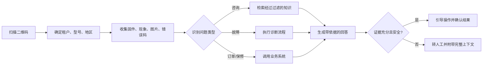

# 海外硬件 AI 智能客服平台

## 面向合伙人讨论的产品方案（初稿）

**目标客户**：海外年销售额约 1-5 亿元人民币的硬件厂商，例如机顶盒、智能电视、投影仪、智能家居和消费电子品牌。

**一句话定位**：扫码即识别设备的 AI 售后诊断与知识运营平台，让海外用户获得 7×24 小时、与具体型号和版本匹配的技术支持；无法可靠解决时，将完整上下文交给人工客服。

---

## 1. 为什么值得做

海外硬件厂商普遍面临三类成本：多语言客服难招且昂贵、非工作时间无人响应、产品型号/固件/地区差异让新人客服很难快速掌握专业知识。小厂商通常既不愿养大型客服团队，也无力自研一套完整的智能客服产品。

但“上传 PDF 的聊天机器人”不是壁垒。成熟客服产品已支持帮助中心、网页、PDF、外部知识源和历史客服内容。我们应聚焦“设备识别 + 故障诊断 + 知识治理 + 人工协同”，而不是泛客服。

### 目标价值

- 降低一线客服重复问题的人工占用。
- 缩短首响时间和平均解决时间，覆盖非工作时间。
- 提升一次解决率，减少因错误指引造成的退货、差评和重复咨询。
- 将分散在说明书、工单和资深员工脑中的经验沉淀为可复用资产。

---

## 2. 产品定位与差异化

> **面向出海硬件厂商的设备售后解决代理，而不是通用 AI 聊天机器人。**

| 通用客服知识库 | 本产品应提供的能力 |
| --- | --- |
| 用户自己描述产品 | 扫码确定租户、型号、地区；可进一步关联批次或序列号 |
| 按文档相似度回答 | 按型号、硬件版本、固件、地区、有效期过滤后再回答 |
| FAQ 问答 | 逐步故障排查、分支判断、预期结果、停止条件 |
| 低置信度泛泛回复 | 自动带齐上下文转人工或工单 |
| 单纯对话统计 | 发现知识缺口、版本冲突、高频故障与产品质量信号 |

### 建议的首个切入点

先选择一个品类和一家试点客户，例如 Android 机顶盒或投影仪。以一个产品系列跑通，再扩展到其他硬件。起步阶段最重要的不是 SKU 数量，而是对高频故障的解决深度。

---

## 3. 核心：五层知识体系

### 3.1 产品主数据：先知道用户手里是什么

每个产品要有：品牌、系列、型号、别名、硬件版本、生产批次、固件/App 版本、销售地区、配件、接口、保修范围、已知缺陷。

二维码推荐携带签名后的产品标识：

```text
tenant + product_model + region + optional_batch_or_serial + signed_token
```

扫码后，系统天然限定了可使用的知识范围，避免把 A 型号的方案回答给 B 型号。

### 3.2 文档知识：有出处的事实层

来源包括用户手册、安装指南、FAQ、固件更新说明、错误码表、售后政策、接线图、界面截图和已确认的维修记录。

文档解析时必须保留版本、适用型号、地区、语言、章节、表格和图片说明；不能把所有 PDF 粗暴切成无上下文文本。

### 3.3 诊断流程：真正的专业能力

将“Wi-Fi 连不上”“无信号”“遥控器失灵”“错误码 E102”等高频问题整理成可执行的故障树，而不只是文章。

```yaml
适用范围: X100 / 固件 2.1+ / EU
触发条件: 无法连接 Wi-Fi 或错误码 E102
前置问题: 是否能搜索到其他网络？路由器是否为 5GHz？
步骤: 重启设备与路由器 → 检查网络频段 → 重置网络设置
每步结果: 成功结束；失败进入下一分支
停止条件: 异常发热、烧焦气味、电源接口损坏
人工升级: 全部步骤失败、涉及保修或更换
```

### 3.4 历史案例：从工单中挖掘，但不自动信任

历史客服工单应经过聚类、去重和专家审核。AI 可以据此生成知识草稿，但未经审核的客服回答、过期经验和偶然成功案例不能直接发布为正式知识。

### 3.5 政策与安全：由规则强制执行

保修、退款、换货、隐私、电气安全和拆机风险必须由工作流和权限控制，不应只依赖提示词约束。

---

## 4. 用户对话与诊断流程



对话原则：

- 先问一个最有区分度的问题，再给下一步，不要一次堆十条操作。
- 每一步说明预期现象，让用户确认结果。
- 明确区分“已知事实”“可能原因”“需要确认的信息”。
- 没有适用知识时坦诚说明，并转人工；禁止编造。

图片能力可用于识别错误码、指示灯、接口、遥控器和产品标签，但涉及进水、烧焦、拆机、电源异常时必须停止自助诊断。

---

## 5. 技术架构原则

### 运行时

1. 二维码或用户输入确定产品上下文。
2. 识别意图：咨询、故障、保修、订单、投诉。
3. 用产品元数据做强过滤：租户、型号、硬件版本、固件、地区、有效期。
4. 采用关键词 + 向量的混合检索，错误码和型号等精确术语提高权重。
5. 对候选内容重排序，取少量最相关且有依据的内容回答。
6. 若证据不足、知识冲突或存在安全风险，升级人工。

### 后台

- 租户、产品、二维码和版本管理
- 文档上传、解析、校对与来源追溯
- FAQ 与故障流程编辑器
- 知识审核、发布、回滚、过期提醒
- 术语表与多语言审核
- 人工接管、工单与消息渠道集成
- 模型供应商、密钥、费用、限额配置
- 质量抽检、知识缺口与运营统计

### 部署形态

建议同一套代码支持三档：

1. 客户独立实例 + 外部大模型 API。
2. 部署至客户云账户/VPC。
3. 完全离线部署 + 本地模型。

第三档交付和推理成本最高，不建议作为 MVP 的必选项。

---

## 6. 人工接管是产品的一部分

不要依赖模型自报“置信度”。应根据客观信号升级人工：没有适用知识、知识冲突、连续排查失败、涉及安全/退款/保修、图片无法确认、用户明确要求人工或明显不满。

交接包必须自动包含：

- 型号、硬件/固件版本、地区、语言
- 用户问题摘要和完整对话
- 已尝试步骤及结果
- 图片、错误码
- AI 引用的知识和建议的下一步
- 用户联系方式、当地时间、优先级

这样人工客服无需从头问起。

---

## 7. 知识运营闭环与指标

```text
真实对话 → 识别未解决/低质量问题 → 归因分类 → 生成知识草稿
→ 专家审核 → 发布新版本 → 回归评测 → 线上监控
```

建议把失败原因分为：知识缺失、检索错误、回答错误、流程设计不佳、产品缺陷、售后政策限制、用户操作/表达不清。

上线评测不能只看“回答是否流畅”，应看：

- 型号与版本识别准确率
- 相关知识召回率
- 回答有据可查率
- 操作步骤完整率
- 错误型号知识使用率
- 危险操作拦截率
- 应转人工时的准确率
- 自主解决率、重复咨询率、平均解决时长、CSAT

测试集应来自真实历史工单，由资深售后给出标准答案和处理路径。知识或模型策略变更后需重新评测。

---

## 8. 建议的 MVP 范围

### 第一阶段

- 1 家试点厂商、1 个产品品类、1 个产品系列
- 英语 + 1 门目标市场语言
- 二维码绑定型号
- 文字与图片对话
- 文档知识库 + 高频故障流程
- 一种人工转接方式：邮件、WhatsApp 或既有工单系统
- 基础知识审核、质量统计、模型 API 配置
- 单租户容器化部署

### 不建议放入第一版

- 覆盖所有硬件品类
- 完全离线大模型部署
- 全渠道呼叫中心
- 自动退款、自动换货、自动远程控制
- 未经审核的知识自动发布

---

## 9. 需要与合伙人和试点客户验证的假设

1. 目标厂商是否愿意提供说明书、历史工单和售后专家时间？
2. 购买决策人是谁：老板、售后负责人、海外销售还是 IT？
3. 客户最愿意为降低人工成本、延长服务时间、减少退货还是提升满意度付费？
4. 私有化是否为硬性要求，还是可接受客户 VPC / 独立实例？
5. 现有售后入口是什么：邮件、WhatsApp、Facebook、经销商、电话还是自建站？
6. 二维码能否在生产、包装或说明书环节接入？
7. 试点产品的高频问题、语言分布和工单规模分别是什么？

---

## 10. 建议的下一步

先找一家愿意共创的硬件厂商，拿到一个产品系列的真实说明书、历史工单和一位售后专家。用高频问题做出一套可运行的诊断知识样板，再决定平台能力和报价方式。

最应该先验证的不是“大模型能不能聊天”，而是：

> 在准确识别产品和版本的前提下，AI 能否安全、稳定地解决真实售后问题，并持续把人工经验沉淀下来。

## 参考资料

- [Intercom - Knowledge Sources](https://www.intercom.com/help/en/articles/9440354-knowledge-sources-to-power-ai-agents-and-self-serve-support)
- [Zendesk - External Content](https://support.zendesk.com/hc/en-us/articles/9822956298010-About-connecting-external-content-to-Zendesk-for-use-across-knowledge-experiences)
- [Anthropic - Contextual Retrieval](https://www.anthropic.com/engineering/contextual-retrieval)
- [Microsoft - RAG in Azure AI Search](https://learn.microsoft.com/en-us/azure/search/retrieval-augmented-generation-overview)
- [OpenAI - Evals Guide](https://developers.openai.com/api/docs/guides/evals)
